# GameWorld & related features — implementation history and rationale

This document summarizes the **step-by-step changes** made to support authenticated access, spawn handling, local persistence, multiplayer visibility, and remote animations. It also explains **why** each approach was used instead of alternatives.

---

## 1. Goal (what we were building)

- **Auth**: Only signed-in users reach the game; unauthenticated users go to login.
- **Spawn**: Prefer restoring the player’s last position when possible; otherwise use a **small set of fixed spawn tiles** (no dependency on scanning the whole map for walkable cells).
- **Persistence of position**: Avoid writing to the database on every movement; **localStorage** while playing, with optional DB flush removed from GameWorld when the `characters` table was not available.
- **Multiplayer**: Show other online players on the same map **without** requiring a `characters` table — use **Supabase Realtime** only.
- **Correctness**: One Supabase client in the browser; **Realtime presence** still uses a **unique key per tab**; **on-screen remotes** are **one sprite per account** (`user_id`); **live position** and **walking animation** for remotes.

---

## 2. Route protection and session hydration

### Changes

- [`app/pages/index.vue`](app/pages/index.vue): `definePageMeta({ middleware: "auth" })` so `/` is protected.
- [`app/middleware/auth.ts`](app/middleware/auth.ts): Middleware is **async**. If `useState('auth.user')` is empty, it calls **`supabase.auth.getSession()`** and sets `auth.user` from the session when present. Only if there is still no user and the route is not `/login`, it **`navigateTo('/login')`**.

### Why this way

- **Named middleware** (`auth.ts`, not `auth.global.ts`) keeps control: only routes that opt in are protected.
- **Hydration from `getSession()`** is necessary because `useState('auth.user')` is not automatically filled from cookies on first paint. Without it, users with a **valid stored session** would be incorrectly redirected to login on every full page load.
- Alternatives (e.g. global middleware on every route) would be heavier and easier to get wrong for public pages.

---

## 3. Login page behavior

### Changes

- [`app/pages/login/index.vue`](app/pages/login/index.vue): On successful sign-in, **`user.value = data.user`** and **`navigateTo('/')`**. If `getSession()` on mount finds an existing session, same redirect.
- Removed the old behavior that called `login()` with empty credentials when no session existed (that would submit invalid credentials).

### Why this way

- **`auth.user` must be set** after password login so middleware and GameWorld see the same user as Supabase Auth.
- Redirect to **`/`** matches the protected game entry point.

---

## 4. Single Supabase client (`useSupabase`)

### Changes

- [`app/composables/useSupabase.ts`](app/composables/useSupabase.ts): The client is created **once** via **`useState('supabase-js-client', () => createClient(...))`** and every `useSupabase()` returns that same instance.

### Why this way

- Previously, **each** `useSupabase()` call ran **`createClient()`** again, which created **multiple GoTrueClient** instances sharing the same storage key → browser warning and possible undefined auth behavior.
- **`useState`** gives one instance per Nuxt app lifecycle and avoids a naive **module singleton** that could be unsafe under **SSR** (shared across requests). This project often runs as SPA (`ssr: false`), but `useState` remains the idiomatic Nuxt pattern.

---

## 5. Spawn points and local position (GameWorld)

### Changes

- [`app/constants/world-constants.ts`](app/constants/world-constants.ts): **`HERO_SPAWN_TILE_COORDS`** — a short list of **tile coordinates** (e.g. four tiles). Helpers: **`pickRandomHeroSpawnPosition`**, **`tileCoordsToHeroPosition`**, **`isPositionWithinMapBounds`**.
- [`app/utils/worldPositionStorage.ts`](app/utils/worldPositionStorage.ts): Read/write **`catchup-chat:worldPos:<userId>`** in **localStorage**.
- **GameWorld** (conceptually): Initial position uses **localStorage** when in map bounds; otherwise default tile (e.g. `(3,3)`). Movement updates **debounced** localStorage; **no** `characters` table reads/writes for GameWorld after multiplayer moved off the DB.

### Why this way

- **Fixed spawn list** avoids maintaining a full **solid-tile walkability** scan from `map.json` in the store and keeps spawn logic predictable and editable by designers.
- **localStorage** reduces write load and avoids needing a table for “last position” in GameWorld when Supabase schema is absent or unused here.
- **Bounds check** prevents applying corrupted or old storage values.

*(Note: `character.store.ts` may still contain DB helpers for other features; GameWorld multiplayer no longer depends on the `characters` table.)*

---

## 6. Multiplayer without `public.characters`

### Problem

- Postgres **`characters`** table was not available → queries and `postgres_changes` failed.
- **Presence `track()` alone** does not reliably push **every** position update to peers; remotes looked **frozen**.

### Changes (Realtime channel `gameworld`)

1. **Single game tab (same browser profile)** — [`claimSingleGameTab`](../app/composables/useSingleGameTab.ts) assigns each tab a UUID, writes it to **`localStorage`** under **`catchup-gameworld-active-tab`**, and listens for the **`storage`** event. When **another tab** overwrites that value, this tab runs **`teardownSupersededSession`**: remove Realtime `gameworld` channel, clear remote sprites, stop the Pixi ticker and keyboard, show **“This game is open in another tab”** with **Reload**. GameWorld runs this only on the client (`import.meta.client`). **Dispose** removes the listener and deletes the key **only if** this tab still owns it (so a superseded tab does not clear the winner’s key). This does **not** coordinate across different browsers or incognito; only **shared `localStorage`** tabs are serialized. If you previously created **`game_client_lease`** in Supabase, apply [`supabase/migrations/20260416120000_drop_game_client_lease.sql`](../supabase/migrations/20260416120000_drop_game_client_lease.sql) (or run `drop table if exists public.game_client_lease cascade;`) to remove the unused table.
2. **`config.broadcast`** — `broadcast: { self: true }` so clients can send/receive **broadcast** messages on the same channel as presence.
3. **Presence** — **`presence.key`** and broadcast **`sender_key`** are **`session.user.id`** (`selfPresenceKey`), consistent with **one live connection per user** per browser profile (enforced by the tab guard).
4. **Broadcast event `pos`** — Throttled sends **`{ sender_key, user_id, x, y, facing, moving }`**. Receivers **`upsertRemoteSprite`** from broadcast.
5. **Rendering: one remote sprite per `user_id`** — Pixi maps (`remotePlayerContainers`, `remotePlayerAnimByUserId`) are keyed by **`user_id`**. **`upsertRemoteSprite`** skips **`user_id === session.user.id`** (local hero only).
6. **Removal / pruning** — **`receivePresenceState`** runs on **`sync`** and **`join`** (upsert only, **no prune**). **`pruneRemoteSpritesNotInPresence`** runs only on **`leave`**, after receive. Pruning on every **`sync`** was removed because **`presenceState()`** can be **briefly empty or incomplete**.

### Why this way

- **Broadcast** is appropriate for **high-frequency** state (position); **Presence** is better for **membership** and coarse sync.
- **Browser `localStorage` + `storage`** is enough for **“new tab wins”** in the same profile without DB or Realtime replication. Enforcing **one client across devices or browsers** would require a server-side or DB lease again.
- **Presence key = `user_id`** is valid while only one connection per user exists in that profile (tab guard); keys remain unique **across** users.
- **Prune only on `leave`** keeps remotes in sync when someone disconnects, without wiping everyone on a flaky **`sync`** snapshot.

### 6.1 Realtime flow (flowchart)

Maps [`GameWorld.vue`](../app/components/GameWorld/GameWorld.vue): **which handlers run when**, and **why**. Renders in GitHub, VS Code (Mermaid extension), and many Markdown previews.

```mermaid
flowchart TB
  subgraph init["1. Startup (only if logged in, client only)"]
    L0["claimSingleGameTab: listen storage + set catchup-gameworld-active-tab"] --> A["Create Realtime channel gameworld"]
    A --> B["Register handlers"]
    B --> C["presenceChannel.subscribe()"]
    C --> D{Status SUBSCRIBED?}
    D -->|yes| E["presenceChannel.track user_id, sender_key equals user id, x, y, ..."]
    E --> F["sendBroadcastState — initial pose for others"]
    D -->|no| Z["Wait / error"]
  end

  subgraph outgoing["2. Local movement / animation"]
    G["watch heroPosition"] --> H["throttledBroadcastPos ~50ms"]
    H --> I["sendBroadcastState()"]
    J["watch isMoving, facingDirection"] --> K["sendBroadcastState() immediate"]
    I --> L["Broadcast event pos on channel"]
    K --> L
  end

  subgraph incoming["3. Incoming channel events"]
    M{Which event?}
    M -->|presence sync or join| N["applyPresenceSyncOrJoin()"]
    N --> O["receivePresenceState(presenceState())"]
    O --> P["upsertRemoteSprite per other presence key"]
    P --> Q["Skip if user_id equals session.user.id"]
    Q --> R["Create or update remote Pixi sprite"]

    M -->|presence leave| S["applyPresenceLeave()"]
    S --> T["receivePresenceState(state)"]
    T --> U["pruneRemoteSpritesNotInPresence(state)"]
    U --> V["Collect user_ids still in presence"]
    V --> W["removeRemoteSprite for missing user_ids"]

    M -->|broadcast pos| X["Payload handler"]
    X --> Y{Valid user_id, x, y?}
    Y -->|no| Z2["Ignore"]
    Y -->|yes| AA["upsertRemoteSprite"]
    AA --> AB["Same self skip"]
    AB --> R
  end

  subgraph tick["4. Every frame"]
    AC["heroTick (Pixi ticker)"] --> AD["Move local hero"]
    AD --> AE["For each remote player container"]
    AE --> AF["updateRemoteSpriteTexture"]
  end
```

| Trigger | Code path | Why |
|--------|-----------|-----|
| Another tab overwrites `catchup-gameworld-active-tab` | **`storage`** event → **`teardownSupersededSession`** | **Last tab wins**; older tab tears down `gameworld` and UI. |
| `gameworld` subscribe succeeds | `track` + `sendBroadcastState` | Register in **presence** and send an initial **broadcast** so peers can place you. |
| You move / face changes | `sendBroadcastState` (throttled or immediate) | **Broadcast** carries high-frequency pose; presence alone is not enough for smooth motion. |
| Presence **`sync`** / **`join`** | `receivePresenceState` only | Merge membership and last **tracked** pose. **No prune** so a flaky snapshot does not wipe all remotes. |
| Presence **`leave`** | `receivePresenceState` then **`pruneRemoteSpritesNotInPresence`** | Someone left the channel → remove sprites for `user_id`s no longer in `presenceState()`. |
| **`broadcast` `pos`** | `upsertRemoteSprite` | Apply live **x, y, facing, moving** from peers. |
| Ticker | `updateRemoteSpriteTexture` | Animate remotes; idle timeout stops stuck walk cycles. |

### 6.2 Remote tile occupancy and movement blocking (spatial hash)

[`GameWorld.vue`](../app/components/GameWorld/GameWorld.vue) prevents the **local hero** from stepping onto a tile that **another online player** occupies. That check must be cheap because it runs whenever the player tries to start a move or chain another step while walking.

#### Previous behavior

- **`isTileOccupiedByRemote(pos)`** iterated over **all** entries in **`remotePlayerContainers`** (a `Map` of Pixi containers keyed by `user_id`).
- For each remote, it computed tile indices with **`Math.floor(container.x / tileSize)`** and **`Math.floor(container.y / tileSize)`** and compared them to the target tile.
- **Cost**: **O(n)** per check, where **n** is the number of remote sprites. Every movement validation scanned the full map of remotes.

#### Current behavior

- A parallel structure **`remoteOccupiedTileKeys`**: a **`Set<string>`** of **tile keys** in the same spirit as **`solidTiles`**: **`getTileKey(x, y)`** → `` `${Math.floor(x / tileSize)},${Math.floor(y / tileSize)}` ``.
- **`isTileOccupiedByRemote(pos)`** is implemented as **`remoteOccupiedTileKeys.has(getTileKey(pos.x, pos.y))`** — **O(1)** average time for the lookup.
- **Keeping the Set consistent with sprites**:
  - **`upsertRemoteSprite`** — After the self-skip, if that `user_id` already had a container, **delete** the **old** tile key from the set; after **`container.x` / `container.y`** are updated, **add** the **new** tile key.
  - **`removeRemoteSprite`** — **Delete** that remote’s tile key from the set (using the container’s position) before removing the sprite from the map and the **`remotePlayerContainers`** map.

#### Core difference (summary)

| | Previous | Current |
|---|----------|---------|
| **Data used for “who is on this tile?”** | Scan **`remotePlayerContainers`** every time | **`remoteOccupiedTileKeys.has(tileKey)`** |
| **Per-check complexity** | **O(n)** remotes | **O(1)** lookup |
| **Maintenance** | None (single source of truth was the map) | Explicit **add/remove** on position change and removal so the Set mirrors live remote positions |

**`isMovementBlocked(pos)`** combines **`isTileSolid(pos)`** and **`isTileOccupiedByRemote(pos)`** so walls and occupied-by-remote tiles both block movement.

---

## 7. Remote walking animation

### Changes

- Broadcast / presence payloads include **`facing`** (`Direction`) and **`moving`** (`boolean`), aligned with local `facingDirection` and `isMoving`.
- Per-remote **`remotePlayerAnimByUserId`** (`frameIndex`, `elapsedTime`, `facing`, `moving`, **`lastPacketAt`**) and **`updateRemoteSpriteTexture`** each frame in the same ticker as the local hero, using the same **`ANIMATION_SPEED`** / **`TOTAL_FRAMES`** / **`getFrameTexture`** pattern as the local sprite.

### Why this way

- Remotes had only a **static frame** because nothing drove **texture** updates. **Network state** must include **facing + moving**; **local tick** advances frames the same way as the hero.
- Alternatives (inferring direction only from position deltas) are jittery and worse for idle vs walk.

---

## 8. Remote walk animation stuck “walking” after the other player stops (throttle + idle fix)

### Symptom

Other players’ characters kept **playing the walk cycle** even after the real player had **stopped moving** (stood still).

### Root cause

1. **Broadcast was throttled** (`useThrottleFn`, ~50 ms) for **all** sends, including the payload fields **`moving`** and **`facing`**.
2. **`useThrottleFn` coalesces** rapid calls: the **last** `moving: false` after stopping could be **dropped or delayed** behind the last `moving: true` from walking.
3. When the player stops **on the same tile** (no further `heroPosition` change), **`watch` on `heroPosition` alone** might not fire again — so **only** **`isMoving`** flips to `false`. If **`moving`** was still sent only through the **throttled** path tied to position, peers could **never** receive a reliable **`moving: false`**.

So observers kept **`anim.moving === true`** on the remote sprite and the walk animation **never stopped**.

### Fix (implemented in [`GameWorld.vue`](../app/components/GameWorld/GameWorld.vue))

1. **`sendBroadcastState()`** — Single function that sends the full payload: `x`, `y`, `facing`, `moving`.

2. **Throttle only position-driven updates** — `watch(heroPosition, …)` calls **`throttledBroadcastPos()`** (wrapper around `sendBroadcastState` with `useThrottleFn`) so we do not flood the channel with **every** sub-pixel frame while moving.

3. **Immediate sends for animation state** — **`watch([isMoving, facingDirection], () => sendBroadcastState())`** with **no** throttle. Whenever **`isMoving`** becomes `false` (or facing changes), peers receive **that state immediately**, including **`moving: false`**.

4. **After channel subscribe** — Call **`sendBroadcastState()`** (not the throttled helper) once so the first published state is complete and not delayed by throttle.

5. **Receiver safety net** — Each remote **`RemoteAnimState`** stores **`lastPacketAt`** (updated on every `upsertRemoteSprite`). In **`updateRemoteSpriteTexture`**, if **`anim.moving`** is still `true` but **no packet has been received for `REMOTE_IDLE_MS`** (~180 ms), the client **forces `anim.moving = false`**. This covers **lost or delayed** packets so walk does not loop forever.

### Why this is the right split

- **Position** benefits from **rate limiting** (throttle) to reduce bandwidth.
- **`moving` / `facing`** are **discrete state changes** that must be **delivered reliably** and **on time**; they must **not** share the same throttle as position, or the “stopped” state is lost.
- The **idle timeout** on the receiver is a **defensive** layer for unreliable networks; it is not a substitute for correct immediate sends on the sender.

---

## 9. Ordering of declarations in `GameWorld.vue`

- **`isMoving` / `facingDirection`** (and related refs) are declared **before** `throttledBroadcastPos` and **`watch`**, because the broadcast payload and watchers reference them.

### Why this way

- JavaScript **temporal dead zone**: refs must exist before closures that read them at definition time (and to avoid confusion in `watch` setup).

---

## 10. Summary table

| Concern | Approach |
|--------|----------|
| Gate game | `auth` middleware + session hydration |
| Single auth client | `useState`-backed `createClient` once |
| Spawn without full map scan | Fixed tile list + bounds |
| Last position without DB churn | localStorage per user id |
| Multiplayer without `characters` | Realtime channel + presence + broadcast `pos` |
| Single game tab (same browser) | `claimSingleGameTab` + `localStorage` / `storage`; presence `key` / `sender_key` = `user_id` |
| Remote sprites | Keyed by `user_id` (one character per account) |
| Remote blocks local movement | `remoteOccupiedTileKeys` Set + `getTileKey`; updated in `upsertRemoteSprite` / `removeRemoteSprite` (see §6.2) |
| Smooth remote motion | Broadcast positions + tick-based sprite frames |
| Walking on remotes | Sync `facing` / `moving` + `remotePlayerAnimByUserId` |
| Remote stops walking (no stuck loop) | Immediate `sendBroadcastState` on `isMoving`/`facingDirection`; throttle only `heroPosition`; optional `lastPacketAt` idle cutoff |

---

## 11. Operational notes (Supabase dashboard)

- **Realtime** must be enabled for the project.
- **Broadcast** on channels requires the channel config used in code (`broadcast: { self: true }` etc.).
- If you still have the legacy **`game_client_lease`** table from an older migration, remove it with [`supabase/migrations/20260416120000_drop_game_client_lease.sql`](../supabase/migrations/20260416120000_drop_game_client_lease.sql) (or `drop table if exists public.game_client_lease cascade;` in the SQL Editor). No Realtime publication is needed for tab coordination.
- RLS policies apply to **database** tables only; **Presence/Broadcast** do not use the `characters` table in this GameWorld path.

---

*This file documents the implementation as of the last related edits. If you add sign-up UI or reintroduce a `characters` table, extend this document accordingly.*

---

## Revision history (high level)

| Topic | Notes |
|-------|--------|
| §6 / §6.1 | **`claimSingleGameTab`** / **`localStorage`** (replaces DB lease); flowchart init step + trigger rows; **`receivePresenceState`**; sprites per `user_id`; prune on **`leave`** only. |
| §11 | Drop migration for legacy **`game_client_lease`** if present. |
| §8 added | Documents idle vs walk fix: split throttle vs immediate broadcast, `lastPacketAt`, `REMOTE_IDLE_MS`. |
| §7 updated | Reflects `remotePlayerAnimByUserId` / `lastPacketAt` and split watcher pattern (see §8). |
| §6.2 added | Remote tile occupancy: **`remoteOccupiedTileKeys` Set** and **`getTileKey`** for **O(1)** checks vs prior **O(n)** scan of `remotePlayerContainers`; sync on upsert/remove. |
